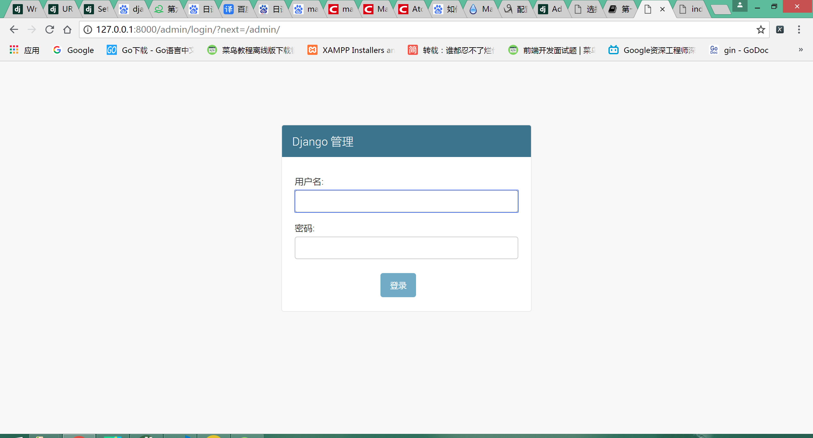
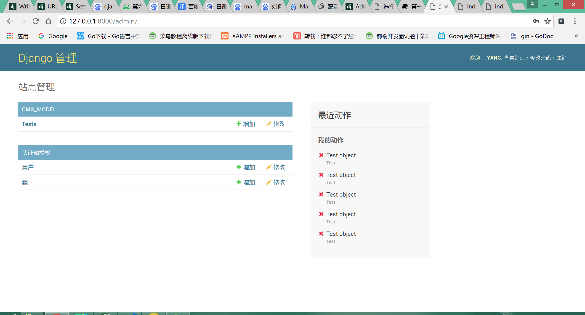
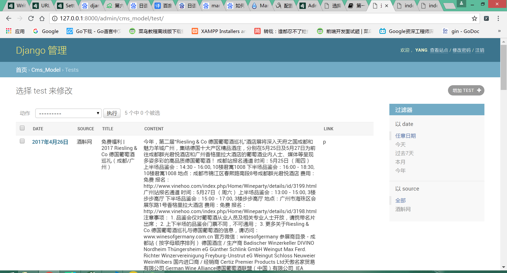
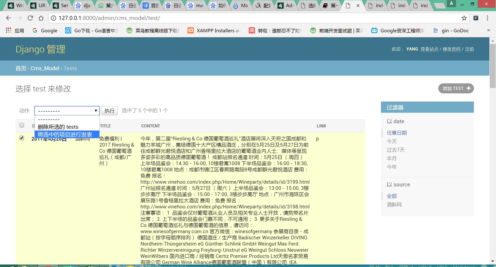

# cms信息管理系统使用说明
>Version 01.0801
[TOC]
## 欢迎使用cms信息管理系统
## 登陆界面
点击 [管理员登陆界面](http://127.0.0.1:8000/admin/ "Title")进行登陆操作，之后可以进行新闻资讯管理。

## 操作管理

### 登陆之后的界面如下

### 点击CMS_MODELS下方的Tests，进入到以下界面

### 左侧复选框可以进行选中操作

随后点击“执行”，即可完成发布操作

## 建议和意见
联系方式:
* QQ邮箱 2932045582@qq.com

[回到顶部](#cms%E4%BF%A1%E6%81%AF%E7%AE%A1%E7%90%86%E7%B3%BB%E7%BB%9F%E4%BD%BF%E7%94%A8%E8%AF%B4%E6%98%8E)